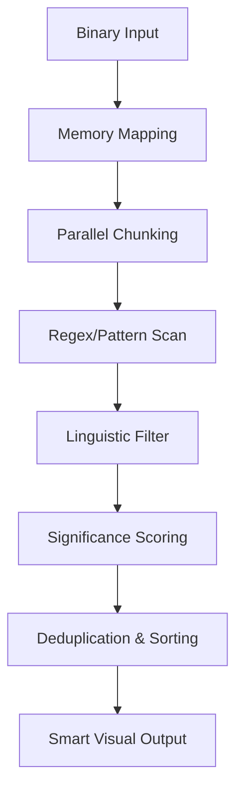

# Strung: Architecture Overview

This document describes the internal design and core components of **Strung**.

## 🏗 High-Level Architecture

Strung is a high-performance CLI tool written in Rust. It utilizes a multi-phase pipeline to extract, filter, and score strings from binary data.

## 🚀 Core Technologies

- **`memmap2`**: Maps the input file directly into memory, providing zero-copy access to even massive (multi-GB) files.
- **`rayon`**: Distributes the scanning workload across all available CPU cores using work-stealing parallel iterators.
- **`object` crate**: Provides binary section awareness (ELF, PE, Mach-O), allowing for targeted scanning of data-rich segments like `.rodata`.

## 🧠 The Intelligence Engine

Unlike standard `strings`, Strung uses a sophisticated filtering system:

1.  **Digram Analysis**: We maintain a frequency table of English and code-common character pairs (digrams). If a string's internal patterns deviate significantly from these, it's flagged as junk.
2.  **Linguistic Balance**: We check for vowel-to-consonant ratios and case transition counts to identify natural-sounding text.
3.  **Symbol Density**: Strings with excessive symbols or random character distributions are penalized or rejected.

## 🛡 Pro Arsenal Components

### Entropy Analyzer
Calculates Shannon entropy in 4KB chunks. High entropy (>7.2) typically indicates encrypted or compressed data, while low entropy (<1.0) suggests sparse or highly structured data.

### Base64 & XOR Deobfuscators
- **Base64**: Automatically detects and decodes Base64-encoded strings during the scan. Decoded payloads are re-run through the filtering engine for validation.
- **XOR**: Brute-forces all 256 possible single-byte XOR keys on the fly. This allows Strung to discover strings that were deliberately hidden to evade static analysis.

---

## 🏎 Performance Optimizations

1.  **Zero-copy Buffer Slicing**: We never copy raw binary data; we operate directly on memory-mapped slices.
2.  **Work-Stealing Iterator**: `rayon` ensures that if one core finishes its chunk early, it "steals" work from other cores to maximize CPU utilization.
3.  **Fast Path Filtering**: The most aggressive filters run first to quickly discard obvious binary noise.
